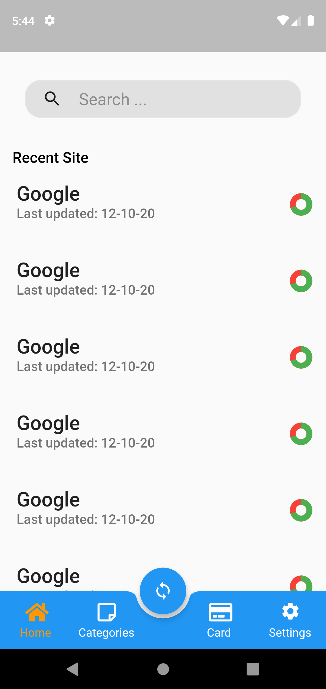
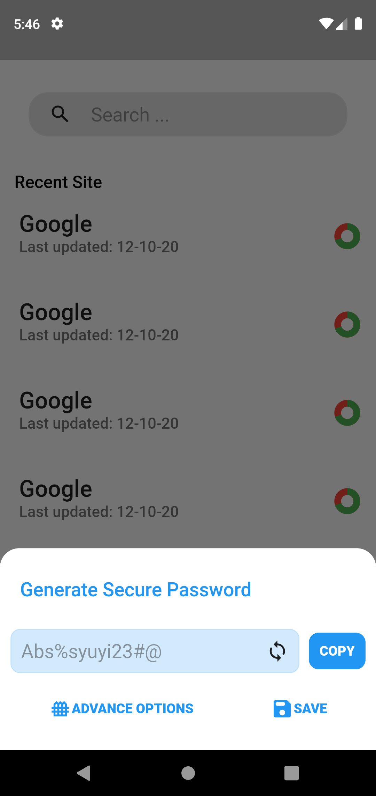
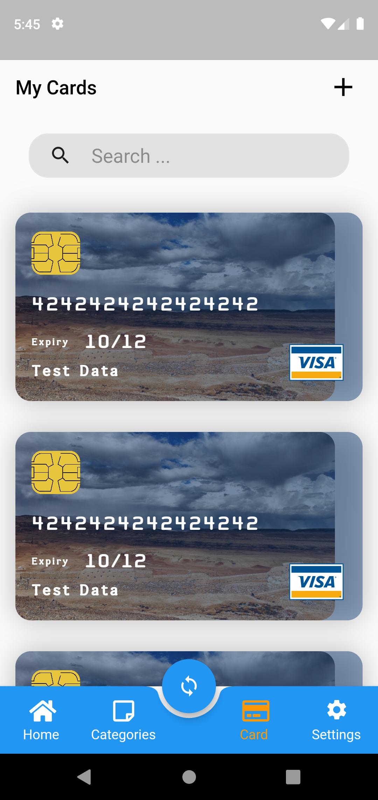

# Password Manager

An easy configurable and highly secure open source password manager.

you can easily config this project and make your own personal password manager,

all the info will be saved into your firebase firestone database as encrypted. There step required

1. Connect with your Firebase account
2. Create your own .env file with password
3. Generate app with flutter

### Encryption Algorithm

- AES with PKCS7 padding

### Screenshot
|Screenshot 1|   Screenshot 2   |   Screenshot 3   |
| ---- | ---- | ---- |
|      |      |      |

